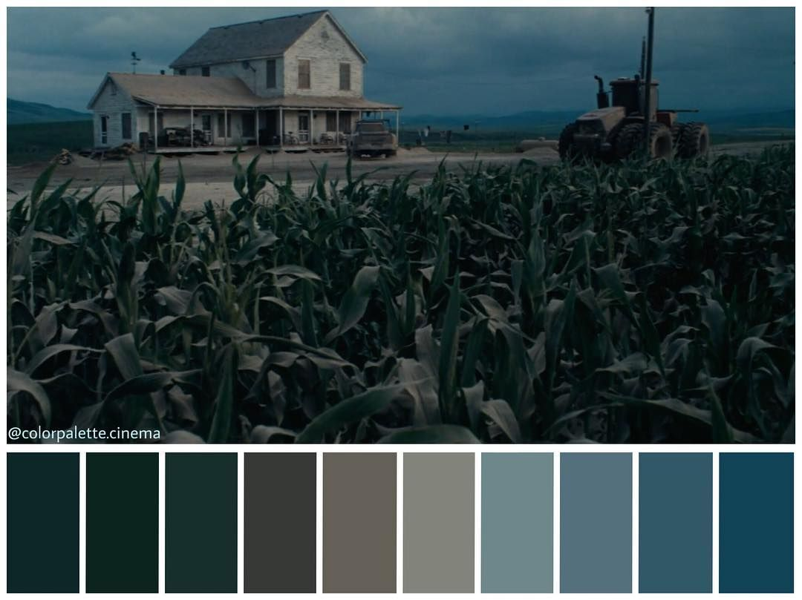
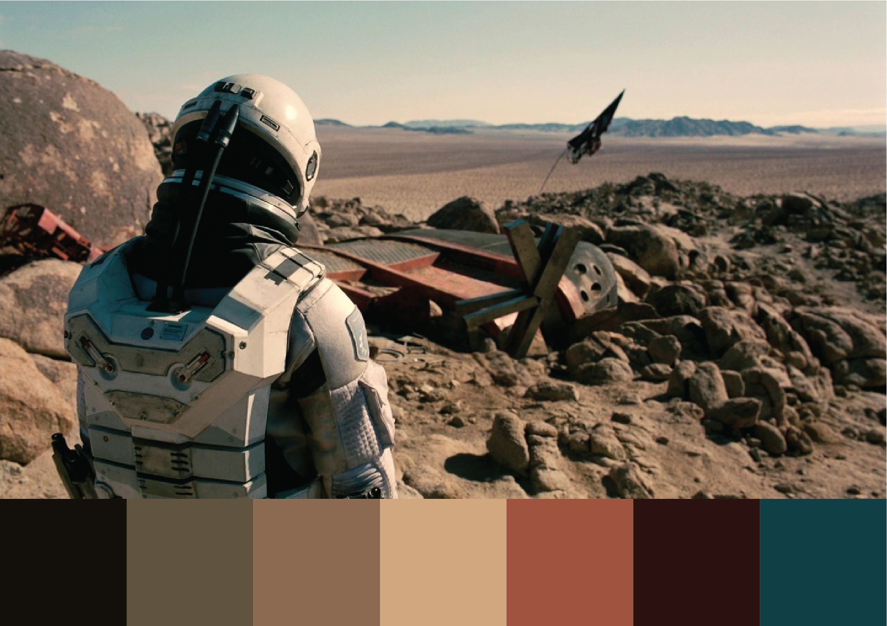
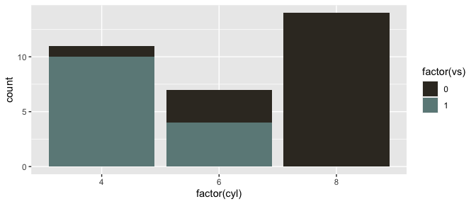
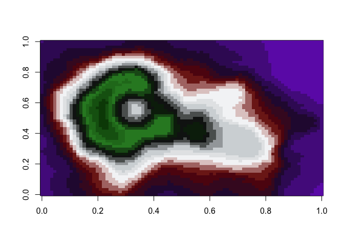

<!-- README.md is generated from README.Rmd. Please edit that file -->
Christopher Nolan Palettes: A Menacing Sea of Dreams
====================================================

<p align="center">

</p>
> Our plots feel real when we see them. It's only when we add color to them that we realize things were strange - Cobb (probably)

Following in the spirit of the wesanderson package, I created a color palette for plots inspired by the films of Christopher Nolan. Palettes were gathered from websites such as [IndieFilming.com](https://indiefilming.com/people/christopher-nolan), the instagram account [colorpalette.cinema](https://www.instagram.com/colorpalette.cinema/), and the use of webscrapping and screenshots.

Installation
------------

``` r
install.packages("ChristopherNolanColorPalette")
```

**Or the development version**

``` r
devtools::install_github("martin726/ChristopherNolanColorPalette")
```

Usage
-----

``` r
library("ChristopherNolanColorPalette")

# See all palettes
names(colorpaletttes)
#>  [1] "DarkKnight1"   "DarkKnight2"   "Inception1"    "Inception2"   
#>  [5] "Inception3"    "Inception4"    "Tenet1"        "Tenet2"       
#>  [9] "Interstellar1" "Interstellar2" "Interstellar3" "Dunkirk1"     
#> [13] "Dunkirk2"      "Dunkirk3"      "Dunkirk4"      "Dunkirk5"     
#> [17] "Dunkirk6"      "Prestige1"     "Prestige2"     "Prestige3"    
#> [21] "Prestige4"
```

Palettes
--------

### The Prestige (2006)

#### Cinematography: Wally Pfister

``` r
nolan_palettes("Prestige1")
```


``` r
nolan_palettes("Prestige2")
```


### The Dark Knight (2008)

<p align="center">

</p>
#### Cinematography: Wally Pfister

``` r

nolan_palettes("DarkKnight1")
```


``` r
nolan_palettes("DarkKnight2")
```


### Inception (2010)

<p align="center">

</p>
#### Cinematography: Wally Pfister

``` r
nolan_palettes("Inception1")
```


``` r
nolan_palettes("Inception2")
```


``` r
nolan_palettes("Inception3")
```


### Interstellar (2014)

#### Cinematography: Hoyte van Hoytema

<p align="center">

</p>
<p align="center">

</p>
``` r
nolan_palettes("Interstellar1")
```


``` r
nolan_palettes("Interstellar2")
```


``` r
nolan_palettes("Interstellar3")
```


``` r
library("ggplot2")
ggplot(mtcars, aes(factor(cyl), fill=factor(vs))) +  geom_bar() +
  scale_fill_manual(values = nolan_palettes("Interstellar1"))
```



### Dunkirk (2017)

Cinematography: Hoyte van Hoytema

``` r
nolan_palettes("Dunkirk2")
```


``` r
nolan_palettes("Dunkirk3")
```


``` r
nolan_palettes("Dunkirk4")
```


The Dark Knight 2 Color Palette (The Joker)

``` r
pal <- nolan_palettes("DarkKnight2", 21, type="continuous")
image(volcano, col = pal)
```


