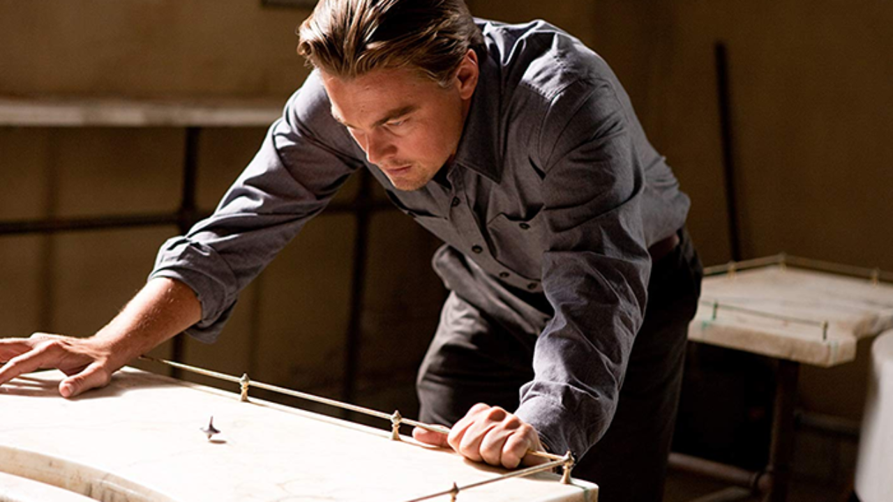

---
output:
  md_document:
    variant: markdown_github
---

<!-- README.md is generated from README.Rmd. Please edit that file -->

```{r, echo = FALSE}
knitr::opts_chunk$set(
  collapse = TRUE,
  comment = "#>",
  fig.path = "figure/",
  fig.height = 1
)
```

# Christopher Nolan Palettes



> Our plots feel real when we see them. It's only when we add color to them that we realize things were strange - Cobb (probably)

Following in the spirit of the wesanderson package, I created a color palette for plots inspired by the films of Christopher Nolan. Palettes were gathered from websites such as [IndieFilming.com](https://indiefilming.com/people/christopher-nolan), the instagram account [colorpalette.cinema](https://www.instagram.com/colorpalette.cinema/), and the use of webscrapping and screenshots. 


## Installation

```r
install.packages("ChristopherNolanColorPalette")
```

__Or the development version__

```r
devtools::install_github("martin726/ChristopherNolanColorPalette")
```

## Usage

```{r, palettes_dummy}
library("ChristopherNolanColorPalette")

# See all palettes
names(colorpaletttes)
```

## Palettes

### The Prestige (2006)

Cinematography: Wally Pfister

```{r, prestige}
nolan_palettes("Prestige1")
nolan_palettes("Prestige2")
```

### The Dark Knight (2008)

Cinematography: Wally Pfister

```{r, darkknight}

nolan_palettes("DarkKnight")
```

### Inception (2010)

Cinematography: Wally Pfister

```{r, inception}
nolan_palettes("Inception1")
nolan_palettes("Inception2")
nolan_palettes("Inception3")
```

### Interstellar (2014)

Cinematography: Hoyte van Hoytema

```{r, interstellar}
nolan_palettes("Interstellar1")
nolan_palettes("Interstellar2")
nolan_palettes("Interstellar3")
```


```{r, ggplot1, fig.height = 3}
library("ggplot2")
ggplot(mtcars, aes(factor(cyl), fill=factor(vs))) +  geom_bar() +
  scale_fill_manual(values = chrisnolan_palettes("Interstellar1"))
```

### Dunkirk (2017)

Cinematography: Hoyte van Hoytema

```{r, dunkirk}
nolan_palettes("Dunkirk2")
nolan_palettes("Dunkirk3")
nolan_palettes("Dunkirk4")
```

```{r, volcano, fig.height = 3}

pal <- nolan_palettes("Interstellar1", 21, type="continuous")
image(volcano, col = pal)
```

```{r, interstellar_heatmap, fig.height = 3}
pal <- nolan_palettes("Interstellar1", 20, type="continuous") # heatmap is a local dataset

ggplot(heatmap, aes(x = X2, y = X1, fill = value)) +
  geom_tile() + 
  scale_fill_gradientn(colors = pal) + 
  scale_x_discrete(expand = c(0, 0)) +
  scale_y_discrete(expand = c(0, 0)) + 
  coord_equal() 

```

### The Darjeeling Limited (2007)

```{r, darjeeling}
wes_palette("Darjeeling1")
wes_palette("Darjeeling2")
```

### Hotel Chevalier (2007)

```{r, chevalier}
wes_palette("Chevalier1")
```

### Fantastic Mr. Fox (2009)

```{r, fantasticfox}
wes_palette("FantasticFox1")
```

### Moonrise Kingdom (2012)

```{r, moonrise}
wes_palette("Moonrise1")
wes_palette("Moonrise2")
wes_palette("Moonrise3")
```

### Castello Cavalcanti (2013)

```{r, castello}
wes_palette("Cavalcanti1")
```

### The Grand Budapest Hotel (2014)

```{r, grandbudapest}
wes_palette("GrandBudapest1")
wes_palette("GrandBudapest2")
```


### The Isle of Dogs (2018)

```{r, isleofdogs}
wes_palette("IsleofDogs1")
wes_palette("IsleofDogs2")
```
